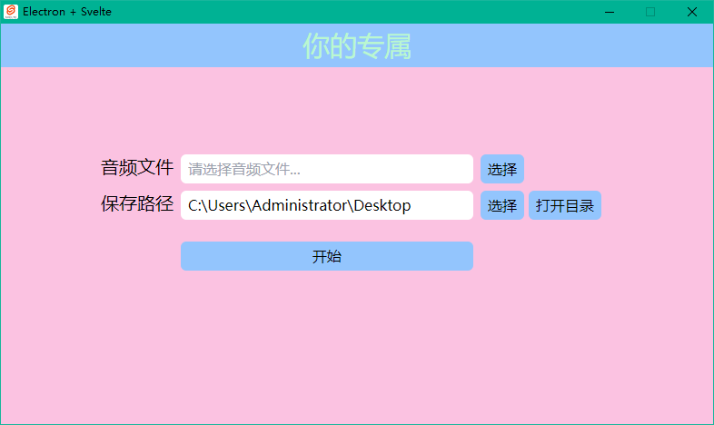

# speech-to-text
  
    语音转文字工具.
    选择音频文件后，稍等片刻，会输出文字文本（Result.txt）。

# 技术栈
  * puppeteer(18.0.5)
  * Electron(20.1.4)
  * Svelte(3.49.0)
  * Tailwind(3.1.8)
  * Vite(3.1.0)
  

# 运行环境 
* **Node 16.16.0**
* **npm 8.19.2**

# 开发环境
* **1. npm install**
* **2. npm run dev**
* **3. npm run cssw**
* **4. npm start**

# 注意
  项目新增extraResources目录，放置两个文件：

  （1）将node_modules/puppeteer/.local-chromium 目录拷贝至此

  （2）下载[ffmpeg.exe](https://www.gyan.dev/ffmpeg/builds/ffmpeg-release-essentials.7z)，并拷贝至此

# 生产打包发布
* **npm run electron:build**
* 最终在 **build** 目录下会生成  **安装包软件** 和 **免安装软件**

# 界面预览

#  特别说明
  1.项目没有经过任何优化，代码超级渣，只是为了实现功能。exe文件大的离谱！

